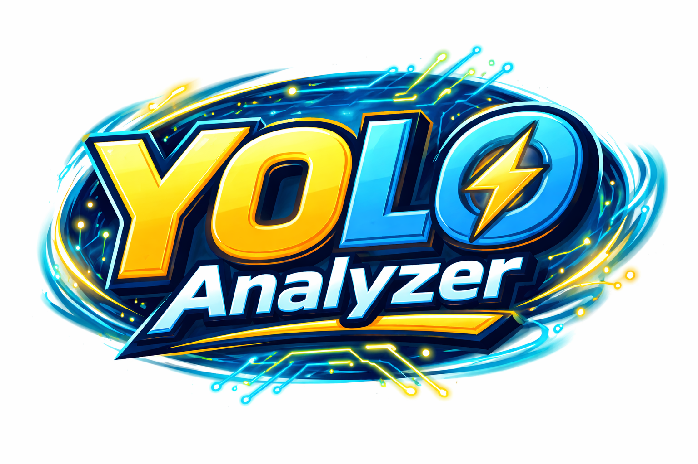

# **RealTimeYOLO Analyzer**

---

# **Overview**

**RealTimeYOLO Analyzer** is a **real-time computer vision analytics system** built using **YOLOv8**, **Python**, **OpenCV**, **Pandas**, and **Matplotlib**.

The purpose of this project is not only to perform **object detection**, but to demonstrate how an AI system can be built with **performance monitoring, analytics, modular architecture, and testing** — all of which are critical components of **production-level machine learning systems**.

The application captures frames from a webcam, performs object detection using a YOLO model, logs inference metrics, and generates analytical charts that allow developers and companies to **evaluate the performance and reliability of their AI system over time**.

This project demonstrates the kind of **end-to-end AI pipeline engineering** that is required in real-world production environments.

---

# **Key Engineering Concepts Demonstrated**

This project demonstrates the following engineering principles:

### **Real-Time AI Inference**
The system processes video frames in real time using YOLO object detection.

### **Modular Architecture**
Each component of the system is separated into independent modules, making the code easier to maintain and extend.

### **Performance Analytics**
The system records inference time and detection metrics and analyzes them using data visualization.

### **Structured Logging**
Detection events and system performance metrics are logged to structured data files.

### **Unit Testing**
The project includes automated tests to ensure reliability and correctness of core components.

### **Data-Driven Optimization**
Performance charts provide insights that allow developers to optimize detection speed and system behavior.

---

# **System Architecture**
